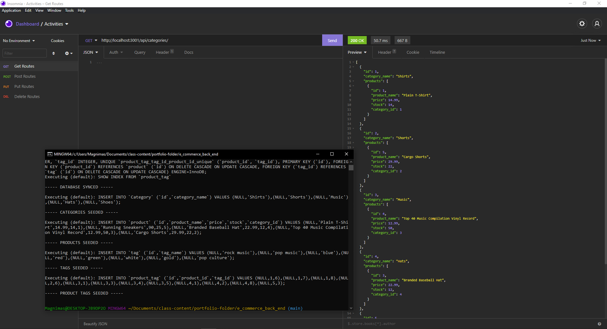

# E-Commerce Back End

Developing the back end of an e-commerce website by modifying starter code.

# Pseudo Code

* WANT a back end for e-commerce website
* WHEN database name, MySQL username, and MySQL password is added to an environment variable file, THEN a connection to a database using Sequelize is established
* WHEN schema and seed commands are entered, THEN a development database is created and is seeded with test data
* WHEN the command to invoke the application is entered, THEN the server is started and the Sequelize models are synced to the MySQL database
* WHEN API GET routes in Insomnia Core for categories, products, or tags are opened, THEN the data for each of these routes is displayed in a formatted JSON
* WHEN API POST, PUT, and DELETE routes in Insomnia Core are tested, THEN I am able to successfully create, update, and delete data in my database

# Screenshot

# Demonstration

# Video

[E-Commerce Back End demonstration video link](https://drive.google.com/file/d/1WnwSylxafS1W9Grp4eb7ylqx6sDBikI7/view?usp=sharing)